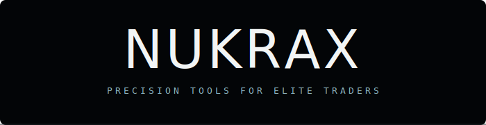

<div align="center">


<br/><br/>



<p>
A private trading ecosystem — institutional-grade Expert Advisors, SMC/ICT strategy<br/>
systems, and live trading infrastructure for serious market participants.
</p>


<br/><br/>

<a href="https://t.me/CosmoLanex">
  
</a>
<a href="https://nukrax.cosmolanex.workers.dev/nukrax-cr">
  
</a>

</div>

<br/>

<div align="center">

[Live Site](https://nukrax.cosmolanex.workers.dev) · [Expert Advisors](#-expert-advisors) · [Design System](#-design-system) · [Structure](#-project-structure)

</div>

<br/>

## ▍ About

**NUKRAX** is a self-contained trading ecosystem spanning three layers of the stack:

- A **web frontend** — homepage, Expert Advisor selection portal, trading journal, and crypto deposit gateway — deployed on Cloudflare Workers.
- **MQL5 Expert Advisors** for MetaTrader 5, covering tick-scalping, Supply & Demand + FVG confluence, and ICT/SMC concept strategies across XAUUSD, EURUSD, USDJPY, and GBPUSD.
- **Arduino / ESP32 firmware** powering companion hardware — OLED status terminals and live trading displays.

The whole system is built around a single design language: dark, minimal, quietly alive — closer to a trading terminal than a marketing site.

<br/>

## ▍ Design System

The site's visual identity is deliberately restrained — a dark control-room palette with a single cool accent, paired with a monospace/geometric-sans type system.

### Palette

| Token | Hex | Usage |
|---|---|---|
|  `--black` | `#030507` | Base background |
|  `--panel` | `#0A0F13` | Panels / cards |
|  `--line` | `#1B2328` | Hairline borders |
|  `--line-lit` | `#2A353C` | Active borders / dividers |
|  `--muted` | `#8A9BA3` | Secondary text |
|  `--text` | `#D3DBDD` | Body text |
|  `--white` | `#F2F5F5` | Headings / emphasis |
|  `--accent` | `#8FB8C4` | Brand accent |
|  `--accent-dim` | `#46626B` | Accent variant / labels |

### Typography

| Role | Font | Notes |
|---|---|---|
| **Logotype** | `NKX Display` | Custom display face, used only for the NUKRAX wordmark (`assets/fonts/nukrax-display.woff2` / `.otf`) |
| **Body / UI** | `Outfit` (200–600) | Primary interface typeface, Google Fonts |
| **Monospace / labels** | `Space Mono` (400, 700) | Section labels, metrics, terminal-style text |

### Motion & Feel

- Cubic-bezier easing throughout (`cubic-bezier(0.22,1,0.36,1)`) for a smooth, weighted feel
- Scroll-triggered reveals on headings, cards, and metrics
- A quietly "alive" system — pulsing status dots, breathing card edges, shimmer sweeps — never flashy, always restrained
- Respects `prefers-reduced-motion`

<br/>

## ▍ Expert Advisors

| EA | Concept | Markets |
|---|---|---|
| Tick-Scalping EA | 3-engine signal vote (Kalman filter, EMA cross, momentum) with asymmetric exits | Short-timeframe scalping |
| Supply & Demand + FVG | Zone mitigation + Fair Value Gap confluence | XAUUSD, EURUSD, USDJPY, GBPUSD — M15–D1 |
| PHASE404 | ICT/SMC concept state-machine EA | EURUSD |

<br/>

## ▍ Project Structure

```
nukrax/
├── assets/              # Logo, fonts, images
├── ea/                  # MQL5 Expert Advisor source files
├── index.html           # Homepage
├── ea-selection.html    # Expert Advisor selection portal
├── crypto.html          # Crypto deposit portal
├── nukrax-tr.html       # Trading journal / results
├── nukrax-cr.html       # Client records / dashboard
├── feedback.html        # Feedback form
├── privacy-policy.html  # Privacy policy
├── redirect.html        # Redirect handler
├── cr-redirect.html     # Redirect handler (CR)
├── data.js              # Shared data layer
└── wrangler.jsonc       # Cloudflare Workers config
```

<br/>

## ▍ Tech Stack

- **Frontend:** Vanilla HTML / CSS / JavaScript, deployed via **Cloudflare Workers**
- **Trading logic:** MQL5 Expert Advisors (MetaTrader 5)
- **Hardware:** Arduino / ESP32 firmware for companion terminal displays
- **Fonts:** [Outfit](https://fonts.google.com/specimen/Outfit) & [Space Mono](https://fonts.google.com/specimen/Space+Mono) via Google Fonts, plus a custom `NKX Display` wordmark face

<br/>

## ▍ Deployment

The site is deployed as a Cloudflare Worker.

```bash
# install wrangler if needed
npm install -g wrangler

# deploy
wrangler deploy
```

<br/>

## ▍ License & Access

This is a **private** trading ecosystem. Source is shared for reference; usage of the EAs, firmware, or brand assets outside of authorized deployments is not permitted.

<br/>

<div align="center">


<br/><br/>

<sub>built by <a href="https://github.com/CosmoLanex">CosmoLanex</a></sub>

</div>

<br/>

